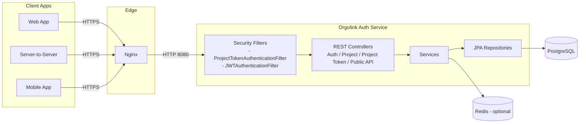
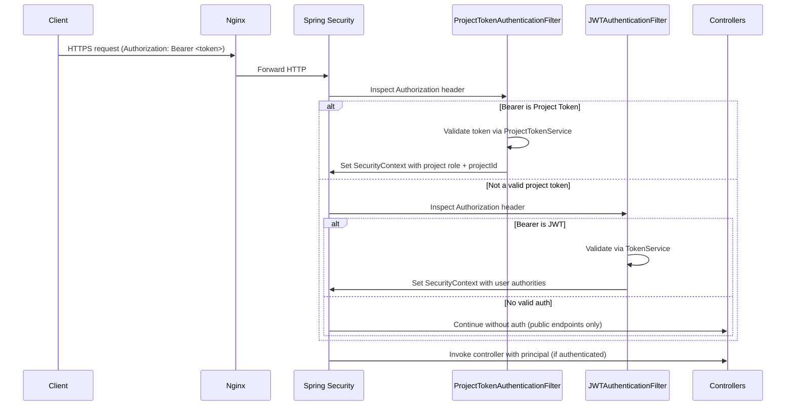
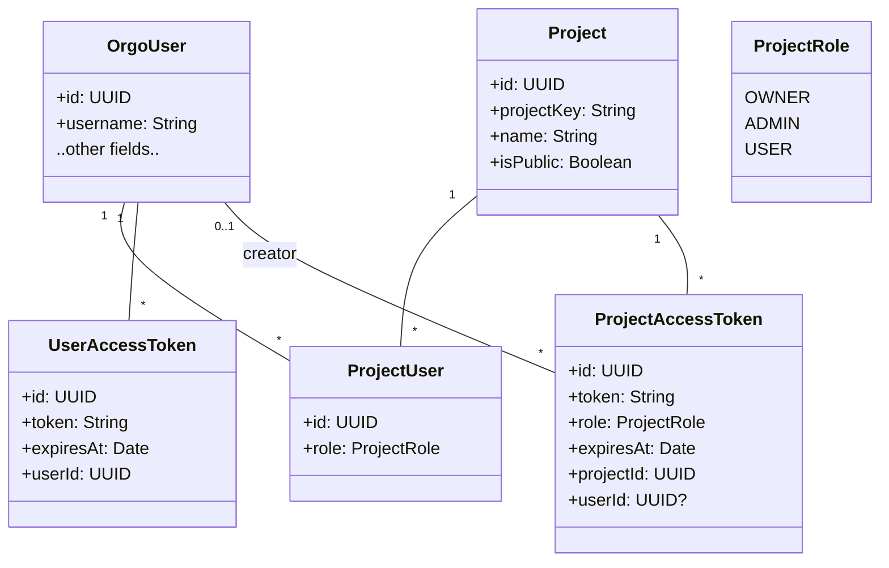
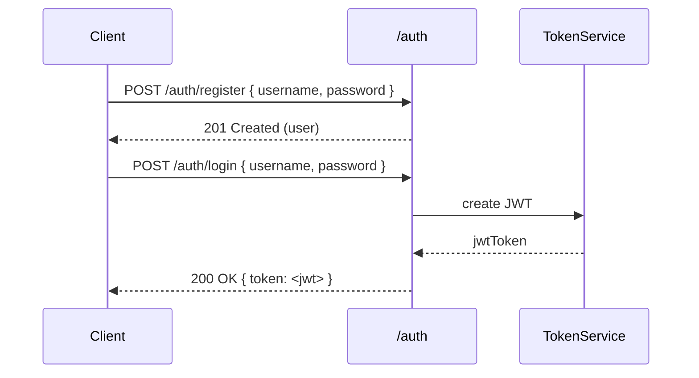
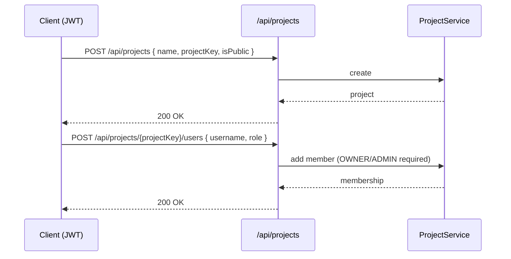
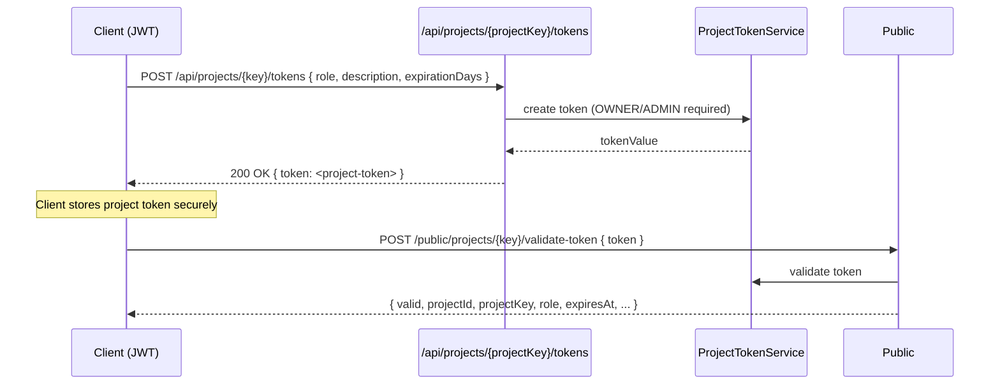
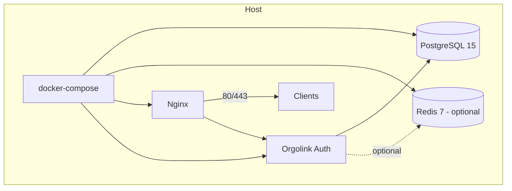

# Orgolink Authentication Service — System Design

This document describes the architecture, core flows, deployment topology, and integration patterns for using Orgolink Auth as an authentication and authorization service for your applications.

- Tech stack: Spring Boot 3 (Kotlin), Spring Security, Spring Data JPA, PostgreSQL, JWT, OpenAPI/Swagger
- Runtime: Java 21, stateless HTTP service
- Diagrams: Mermaid (renderable on GitHub and most Markdown viewers)


## High-Level Architecture



- Requests terminate at Nginx (optional, for TLS offload and routing), then to the Spring app.
- Security filters authenticate requests using either Project Access Tokens or JWTs.
- Services enforce authorization rules based on user membership and roles per project.
- PostgreSQL persists users, projects, memberships, and tokens.
- Redis is provisioned in docker-compose as an optional cache/future use; the core service runs without it.


## Security Model

- Two credential types supported:
  - JWT (user-based) issued by `/auth/login`.
  - Project Access Token (scoped) issued by `/api/projects/{projectKey}/tokens`.
- Authorities added by filters:
  - For JWT: `ROLE_USER` and user’s grant set.
  - For Project Token: `ROLE_USER`, `ROLE_PROJECT_<OWNER|ADMIN|USER>`, and `PROJECT_<projectId>`.
- Stateless sessions with `SessionCreationPolicy.STATELESS` and `BCrypt` password hashing (strength 12).


## Request Authentication Pipeline

In `SecurityConfigs`:
- Allowed without auth: `/public/**`, `/auth/**`, `/register`, `/api/projects/public`.
- Filter order: `ProjectTokenAuthenticationFilter` runs before `JWTAuthenticationFilter`, and both run before `UsernamePasswordAuthenticationFilter`.




## Core Domain and Data Model

Main entities (Spring Data JPA):
- `OrgoUser`: platform user
- `Project`: application/project registered in Orgolink
- `ProjectUser`: membership of a user in a project with a `ProjectRole` (OWNER, ADMIN, USER)
- `UserAccessToken`: JWTs (user-based)
- `ProjectAccessToken`: scoped token bound to a project (and optionally a user)

Relationship overview:



Note: field names are representative; refer to the Kotlin models for exact structure.


## Key Flows

### 1) Register + Login (JWT issuance)



- Use header `Authorization: Bearer <jwt>` for authenticated requests to `/api/**`.

### 2) Create Project and Manage Members



### 3) Generate and Use Project Access Token



- Use header `Authorization: Bearer <project-token>` to call Orgolink-protected APIs with project context.


## Public API Surface (selected)

- Auth
  - POST `/auth/register`
  - POST `/auth/login`
  - POST `/auth/logout`
  - GET `/auth/verify`

- Projects (JWT required unless marked public)
  - POST `/api/projects`
  - GET `/api/projects`
  - GET `/api/projects/public` (public)
  - GET `/api/projects/{projectKey}`
  - PUT `/api/projects/{projectKey}`
  - DELETE `/api/projects/{projectKey}`
  - Users: POST/GET/DELETE under `/api/projects/{projectKey}/users`

- Project Tokens (JWT required)
  - POST `/api/projects/{projectKey}/tokens`
  - GET `/api/projects/{projectKey}/tokens`
  - DELETE `/api/projects/{projectKey}/tokens/{tokenId}`
  - GET `/api/projects/tokens/my`
  - DELETE `/api/projects/tokens/my`

- Public
  - GET `/public/projects`
  - GET `/public/projects/{projectKey}`
  - POST `/public/projects/{projectKey}/validate-token`
  - GET `/public/health`
  - Swagger UI: `/public/swagger-ui.html`


## Authorization Rules (summary)

- Project ownership and admin privileges are enforced in services.
- Actions requiring roles:
  - Create project: any authenticated user.
  - Update/Delete project: OWNER or ADMIN (delete requires OWNER).
  - Add/Remove users: OWNER or ADMIN.
  - Generate/Revoke project tokens: OWNER or ADMIN.


## Deployment Topology



- Docker images: `postgres:15-alpine`, `redis:7-alpine` (optional), `nginx:alpine`, custom app image built from Dockerfile.
- Health checks:
  - App: `GET /public/health`
  - Postgres: `pg_isready`
  - Redis: `redis-cli ping`
- Environment (compose):
  - `SPRING_PROFILES_ACTIVE=docker`
  - `SPRING_DATASOURCE_URL/USERNAME/PASSWORD`
  - `JWT_SECRET`, `JWT_EXPIRATION`


## Configuration

Defaults (see `src/main/resources/application.properties`):
- Active profile: `dev`
- Swagger: `/public/api-docs` and `/public/swagger-ui.html`
- JPA: `ddl-auto=create` for local development
- JWT: `jwt.secret`, `jwt.expiration`
- Server: `server.port=8080`

For Docker: use `application-docker.properties` or env vars in `docker-compose.yml`.


## Integration Patterns

You can consume Orgolink Auth in two ways depending on your system’s architecture.

### A) User-based auth (JWT delegation)

- Your frontend authenticates with Orgolink at `/auth/login` and receives a JWT.
- The frontend includes `Authorization: Bearer <jwt>` when calling your backend.
- Your backend verifies the JWT using Orgolink’s public information or by delegating verification to Orgolink.

Options to verify:
- Local validation: Configure your backend with the same `jwt.secret` (if you control both sides) and standard JWT libs.
- Delegation: Call `GET /auth/verify` with the bearer token from your backend to verify validity and user identity.

Pros: users and their project memberships flow directly via JWT.
Cons: your backend must understand Orgolink roles/memberships for authorization.

### B) Project-scoped auth (access tokens)

- Project OWNER/ADMIN generates a project access token at `/api/projects/{projectKey}/tokens`.
- Your system stores this token securely (e.g., service-to-service secret) and presents it in `Authorization: Bearer <project-token>` when it needs Orgolink-scoped access.
- To validate in your system:
  - Use `POST /public/projects/{projectKey}/validate-token` with `{ token }`.
  - Response includes `valid`, `projectId`, `projectKey`, `role`, `expiresAt`, and optionally `username` if tied to a user.

Typical use cases:
- Server-to-server integration
- Webhook callbacks where the caller presents a project token
- Multi-tenant jobs that need scoped access per project


## Reference Middleware (pseudocode)

JWT guard (Node/Express-style pseudocode):
```ts
function jwtGuard(req, res, next) {
  const auth = req.headers['authorization'] || ''
  if (!auth.startsWith('Bearer ')) return res.status(401).end()
  const token = auth.slice(7)
  // Option 1: locally verify with shared secret
  // Option 2: delegate to Orgolink
  fetch('https://auth.yourdomain.com/auth/verify', {
    headers: { Authorization: `Bearer ${token}` },
  }).then(r => r.ok ? next() : res.status(401).end())
}
```

Project token validator (server-to-server):
```ts
async function validateProjectToken(projectKey, token) {
  const res = await fetch(`https://auth.yourdomain.com/public/projects/${projectKey}/validate-token`, {
    method: 'POST',
    headers: { 'Content-Type': 'application/json' },
    body: JSON.stringify({ token })
  })
  if (!res.ok) return { valid: false }
  const body = await res.json()
  return body.data // contains role, projectId, etc.
}
```


## Observability and Docs

- Health: `GET /public/health`
- OpenAPI: `/public/api-docs`
- Swagger UI: `/public/swagger-ui.html`


## Security Considerations

- Store `JWT_SECRET` and project tokens securely (vault/secret manager).
- Prefer HTTPS termination at Nginx.
- Use short-lived tokens where possible; revoke tokens upon compromise.
- Enforce least-privilege by assigning minimal `ProjectRole` for tokens.


## Appendix: Where Things Live in Code

- App entrypoint: `OrgolinkAuthApplication.kt`
- Security config: `configs/SecurityConfigs.kt`
- Filters: `filters/JWTAuthenticationFilter.kt`, `filters/ProjectTokenAuthenticationFilter.kt`
- Controllers: `controller/*.kt` (Auth, Project, ProjectToken, PublicApi)
- DTOs: `dto/*`
- Entities: `model/*`
- Repositories: `repo/*`
- Services: `services/*`
- Config: `src/main/resources/application*.properties`
- Docker: `Dockerfile`, `docker-compose.yml`, `nginx/nginx.conf`
